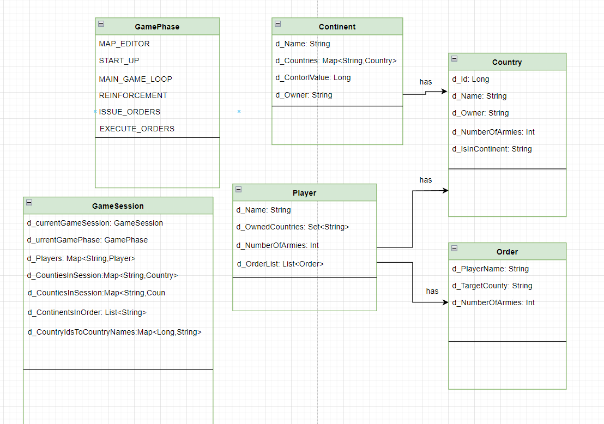
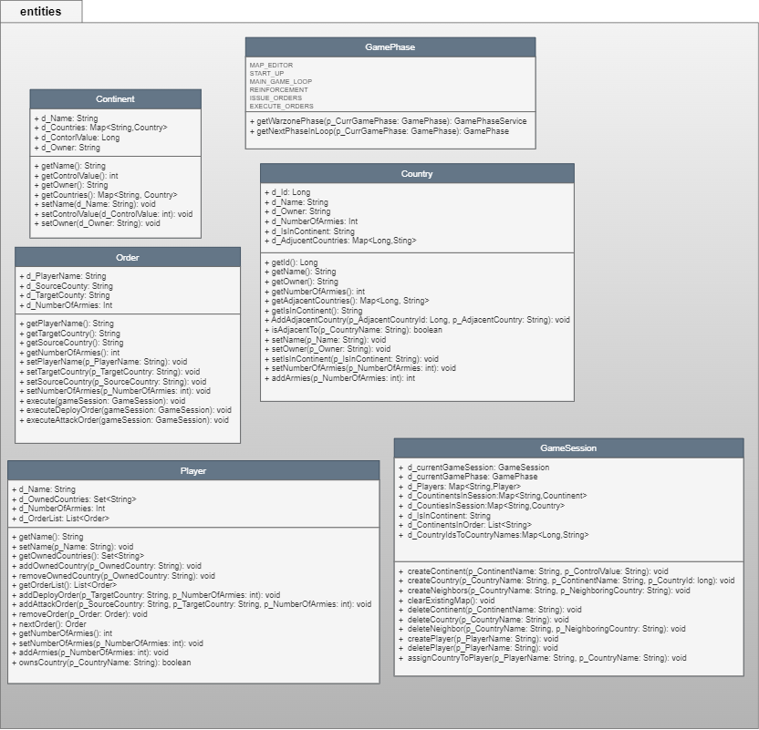
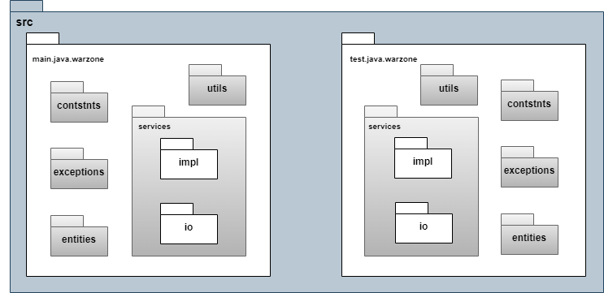
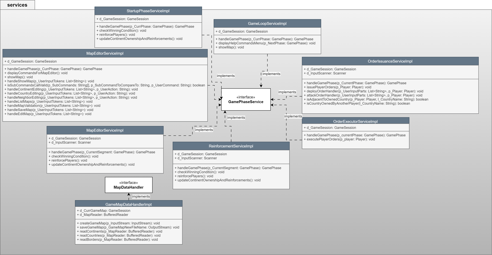
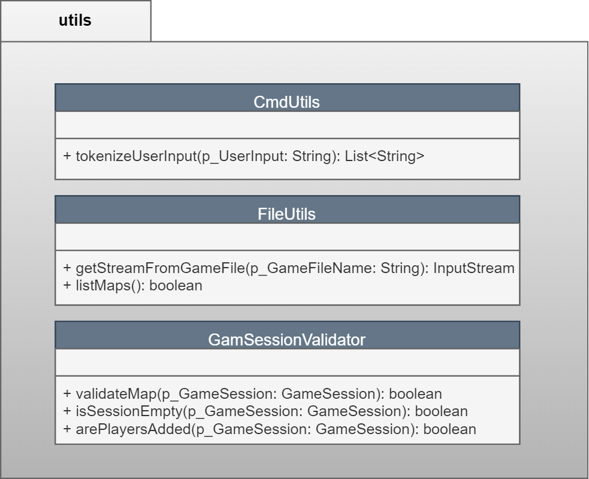

# Risk Game Project

## General Description

Our project is to build a Java program, to be undertaken by our team of 5 members. The project consists of three main components:

1. **First and Second Intermediate Project Delivery**: These are intermediate operational builds of the software, where we'll demonstrate the full implementation of some important software features.
2. **Final Project Delivery**: This is the demonstration of the finalized version of our software.

During the project deliveries, we'll also demonstrate that our code includes many of the Java features presented in the lectures and that we effectively use the tools presented in the lectures in our project. All project deliveries will be undertaken in a Zoom session with a marker where we'll present the implemented features to the markers following a pre-circulated grading sheet.

These activities require some investigations and discussions that are important aspects of real-life software development and this project.

## Problem Statement

Our project for this semester consists of building a simple "Risk" computer game. The developed program will have to be compatible with the rules and map files and the command-line play of the "Warzone" version of Risk, which can be found at [Warzone](https://www.warzone.com/).

A Warzone game setup consists of a connected graph map representing a world map, where each node is a country and each edge represents adjacency between countries. Two or more players can play by placing armies on countries they own, from which they can attack adjacent countries to conquer them. The objective of the game is to conquer all countries on the map.

## Map

The game map is a connected graph where each node represents a territory owned by one of the players. Edges between the nodes represent adjacency between territories. The map is divided into subgraphs that represent continents. A continent is a connected subgraph of the map graph, and every territory belongs to one and only one continent. Each continent is given a control value (a "bonus" in Warzone terminology) that determines the number of armies per turn that is given to a player that controls all of it. During gameplay, every territory belongs to one and only one player and contains one or more armies that belong to the player owning the territory. In your implementation, it will be expected that the game can be played on any connected graph that is defined by the user before play, saved as a text file representation, and loaded by the game during play.

## Game

The game starts with the startup phase, where the number of players is determined, and then all the territories are randomly assigned to the players. The turn-based main play phase begins, in which all players create a set of battle orders. After all the orders have been given for all players for a turn, they are executed by the game engine:

1. **Deployment Orders**: Place some armies on one of the current player’s territories.
2. **Advance Orders**: Move some armies from one of the current player’s territories (source) to an adjacent territory (target). If the target territory belongs to the current player, the armies are moved to the target territory. If the target territory belongs to another player, an attack happens between the two territories.
3. **Special Orders Resulting from Using Cards**:
    - **Bomb**: Destroy half of the armies located on an opponent’s territory that is adjacent to one of the current player’s territories.
    - **Blockade**: Triple the number of armies on one of the current player’s territories and make it a neutral territory.
    - **Airlift**: Advance some armies from one of the current player’s territories to any another territory.
    - **Negotiate**: Prevent attacks between the current player and another player until the end of the turn.

### Issuing Orders

Each player, in round-robin turn order, gives one of their orders. Once all the players have signified that they don’t have any more orders for this turn, the game engine executes all the orders. At the beginning of every turn, the players are given a number of armies that depends on the number of territories they own (# of territories owned divided by 3, rounded down). If the player owns all the territories of an entire continent, the player is given a number of armies corresponding to the continent’s control bonus value. In any case, the minimal number of reinforcement armies for any player is 3. Once the total number of reinforcements is determined for the player’s turn, the player may start giving deployment orders, i.e., placing their reinforcement armies on some of the territories they own. The players can also give advance orders. To do so, the player may choose one of the territories they own that contains one or more armies and order them to advance to another adjacent territory. If the target territory belongs to the same player, army units are moved to the target territory. If the target territory belongs to another player, an attack is simulated when the order is executed. Once all orders have been issued by a player, they signify so to the game engine. Once all the players have signified that they are finished issuing orders, the orders are executed.

### Executing Orders

When executing a deploy order, a number of army units is added to a territory. A move is simply moving army units from one territory to the other. An attack is simulated by the following battle simulation mechanism: First, the attacking player decides how many armies are involved. Then, each attacking army unit involved has a 60% chance of killing one defending army. At the same time, each defending army unit has a 70% chance of killing one attacking army unit. If all the defender's armies are eliminated, the attacker captures the territory. The attacking army units that survived the battle then occupy the conquered territory. A player receives a card at the end of his turn if they successfully conquered at least one territory during their turn.

### Cards

Cards can be played as the players are giving orders. Each card has a different effect that influences the course of the game:

- **Bomb**: The target country loses half of their army units.
- **Reinforcement**: The player receives 5 reinforcement army units.
- **Blockade**: The target territory’s army units count is tripled, and the territory becomes neutral.
- **Airlift**: Move any number of army units from one of your territories to another territory, even if they are not adjacent.
- **Diplomacy**: Until the end of the turn, you and the target player cannot attack each other.

Any player that does not control at least one territory is removed from the game. The game ends at any time one of the players owns all the territories on the map.

## Design

The following shows the class diagrams and package diagrams for the first build:











## Implementation

The most interesting problem revolves around handling the graph data structure for map handling in the game.

The following shows the sample code to perform depth-first traversal to validate if all countries are connected in a given continent:

```java
/**
     * Helper method to perform depth-first traversal to validate if all countries are connected in a given continent.
     *
     * @param p_StartCountry        Country under observation for dfs
     * @param p_GameSession           Entire main.java.game session which has all the continents and their countries with adjacency
     * @param p_VisitedCountries    Countries visited in the current dfs
     * @param p_ValidatingContinent Continent getting validated
     */
    private static void depthFirstTraversal(Country p_StartCountry, GameSession p_GameSession, Set<String> p_VisitedCountries, Continent p_ValidatingContinent) {
        p_VisitedCountries.add(p_StartCountry.getName());
        for (String l_NeighbourCountryName : p_StartCountry.getAdjacentCountries().values()) {
            Country l_NeighborCountry = p_GameSession.getCountriesInSession().get(l_NeighbourCountryName);
            if (!p_VisitedCountries.contains(l_NeighbourCountryName) && l_NeighborCountry.getIsInContinent().equals(p_ValidatingContinent.getName())) {
                depthFirstTraversal(l_NeighborCountry, p_GameSession, p_VisitedCountries, p_ValidatingContinent);
            }
        }

    }
```

## CI/CD pipeline

following is the sample YAML instructions for our CI pipeline:

```yaml
name: Java CI with Maven

on:
   push:
      branches: [ "main" ]
   pull_request:
      branches: [ "main" ]

jobs:
  build:

    runs-on: ubuntu-latest

    steps:
      - uses: actions/checkout@v2
      - name: Set up JDK 17
        uses: actions/setup-java@v1
        with:
          java-version: 17
      - name: Build with Maven
        run: |
          cd ./Warzone/
          mvn clean install
      - name: Run Junit Tests
        run:  |
          cd ./Warzone/
          mvn test
      - name: Check styling
        run:  |
          cd ./Warzone/
          mvn checkstyle:checkstyle
      - name: Generate JavaDoc
        run:  |
          cd ./Warzone/
          mvn javadoc:javadoc
```

